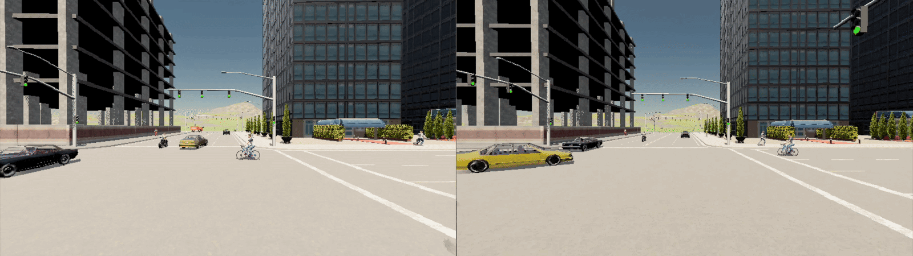
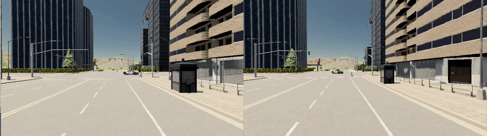

V2X-Cooperative-Perception
======

This is the official implementation of paper. "When Autonomous Vehicle Meets V2X Cooperative Perception: How Far Are We?".

This repository contains a testing framework for Cooperative-Perception termed `V2X-Cooperative-Perception`, for evaluate the impact of imperfect cooperative perception on safety violations in autonomous driving.




- [Supplementary Website](https://sites.google.com/view/v2x-empirical)

## The structure of the repository

```
V2X-Cooperative-Perception
├── RQ3
├── RQ4
├── scripts
├── simulation
│   ├── carla_root
│   ├── checkpoints
│   ├── dataset
│   ├── codriving
│   ├── common
│   ├── leaderboard
│   ├── opencood
│   │   ...
│   │   └──tools
│   │      ├── inference_rq1.py
│   │      └── inference_rq2.py
│   └── scenario_runner
├── spconv
├── README.md
└── requirements.txt
```

## Datasets

Download the dataset in the simulation/dataset folder.

`dataset` folder tree :

```
simuilation/dataset
. 
├── OPV2V
│   ├── additional
│   ├── test
│   ├── train
│   └── validate
├── OPV2V_Hetero
│   ├── test
│   ├── train
│   └── validate
└── V2XSET
    ├── test
    ├── train
    └── validate
```

- OPV2V: Please refer to [this repo](https://github.com/DerrickXuNu/OpenCOOD). You also need to download `additional-001.zip` which stores data for camera modality.
- OPV2V-H: Please download data in [Huggingface Hub](https://huggingface.co/datasets/yifanlu/OPV2V-H). Please refer to [Downloading datasets](https://huggingface.co/docs/hub/datasets-downloading) tutorial for the usage.
- V2XSet: For the complete dataset, Please refer to [this repo](https://github.com/DerrickXuNu/v2x-vit).
- V2XSet-part: Experimental data in RQ2, Please refer to [this repo](https://drive.google.com/drive/folders/1QQCy1rtf6FbIgdkoL0HG-Gt1K2lw3bj_?usp=share_link).

## Checkpoints

- [Download Pre-trained Collaborative Perception Model](https://huggingface.co/pangdudu/V2X-Cooperative-Perception)

`checkpoints` folder tree :

```
checkpoints
├── RQ1
│   ├── opv2v_camera_attfuse
│   ...
│   ├── opv2v_lidar_attfuse
│   ...
│   └── opv2v_lidarcamera_attfuse
├── RQ2
│   ...
│   └── v2xset_attfuse
└── RQ3&RQ4
    ├── early_fusion
    │   ├── perception
    │   └── planner
    ├── late_fusion
    ├── fcooper
    └── v2xvit

```

## Before RQ1 / RQ2

### RQ1 and RQ2 working environment

- Ubuntu 20.04
- Python 3.8
- CMake 3.22.1
- PyTorch 1.12.0
- CUDA 11.6

#### Basic Installation

```
conda create -n v2x-hybrid python=3.8 cmake=3.22.1
conda install pytorch==1.12.0 torchvision==0.13.0 torchaudio==0.12.0 cudatoolkit=11.6 -c pytorch -c conda-forge
conda activate v2x-hybrid
pip install spconv-cu116 # match your cudatoolkit version
```

#### Dependency repository

- [Opencood](https://github.com/DerrickXuNu/OpenCOOD)

OpenCOOD is an Open Cooperative Detection framework for autonomous driving that allows users to train and test various collaborative perception models.

Installation of OpenCOOD :

```
# Install the requirements.
cd simulation
pip install -r requirements_rq1&rq2.txt
python setup.py develop

# Install bbx nms calculation cuda version
python opencood/utils/setup.py build_ext --inplace
```

### Usage


#### Train the model

We uses yaml file to configure all the parameters for training. To train your own model from scratch or a continued checkpoint, run the following commonds:

```
python opencood/tools/train.py -y ${CONFIG_FILE} [--model_dir ${CHECKPOINT_FOLDER}]
```

Arguments Explanation:

- `-y` or `hypes_yaml` : the path of the training configuration file, e.g. `opencood/hypes_yaml/opv2v/LiDAROnly/lidar_fcooper.yaml`, meaning you want to train a FCooper model. We elaborate each entry of the yaml in the exemplar config file `opencood/hypes_yaml/exemplar.yaml`.
- `model_dir` (optional) : the path of the checkpoints. This is used to fine-tune or continue-training. When the `model_dir` is given, the trainer will discard the `hypes_yaml` and load the `config.yaml` in the checkpoint folder. In this case, ${CONFIG_FILE} can be `None`,

#### Train the model in DDP

```
CUDA_VISIBLE_DEVICES=0,1 python -m torch.distributed.launch  --nproc_per_node=2 --use_env opencood/tools/train_ddp.py -y ${CONFIG_FILE} [--model_dir ${CHECKPOINT_FOLDER}]
```

`--nproc_per_node` indicate the GPU number you will use.

### For RQ1

- How does equipping cooperative agents with heterogeneous sensors affect the performance of cooperative perception systems?

```
python opencood/tools/inference_rq1.py --model_dir ${CHECKPOINT_FOLDER} [--fusion_method intermediate]
```

- `inference_rq1.py` has more optional args, you can inspect into this file.
- `--model_dir`  the path of the checkpoints. We now support LiDAR-based cooperation, camera-based cooperation, and hybrid multimodal (LiDAR and camera) sensor cooperation.
- `[--fusion_method intermediate]` the default fusion method is intermediate fusion. According to your fusion strategy in training, available fusion_method can be:
    - **single**: only ego agent's detection, only ego's gt box. *[only for late fusion dataset]*
    - **no**: only ego agent's detection, all agents' fused gt box. *[only for late fusion dataset]*
    - **late**: late fusion detection from all agents, all agents' fused gt box. *[only for late fusion dataset]*
    - **early**: early fusion detection from all agents, all agents' fused gt box. *[only for early fusion dataset]*
    - **intermediate**: intermediate fusion detection from all agents, all agents' fused gt box. *[only for intermediate fusion dataset]*

### For RQ2

- What are the differences in cooperative perception performance between V2V and V2I cooperation modes?
- In V2XSET, we have retained only scenarios where both Inf. and CAV are present.

```
python opencood/tools/inference_rq2.py --model_dir ${CHECKPOINT_FOLDER} [--fusion_method intermediate] --mode [cv/inf]
```

- `inference_rq2.py` has more optional args, you can inspect into this file.
- `[--fusion_method intermediate]` the default fusion method is intermediate fusion. According to your fusion strategy in training, available fusion_method can be:
    - **single**: only ego agent's detection, only ego's gt box. *[only for late fusion dataset]*
    - **no**: only ego agent's detection, all agents' fused gt box. *[only for late fusion dataset]*
    - **late**: late fusion detection from all agents, all agents' fused gt box. *[only for late fusion dataset]*
    - **early**: early fusion detection from all agents, all agents' fused gt box. *[only for early fusion dataset]*
    - **intermediate**: intermediate fusion detection from all agents, all agents' fused gt box. *[only for intermediate fusion dataset]*
- `--mode` specifies the type of cooperative agent, where `cv` stands for cooperative vehicle and `inf` stands for cooperative infrastructure.

### Output Format

The information such as model type and evaluation range will be recorded in the file name.

#### RQ1

```yaml
AP_50: 
CADE_50: 
CCLE_50: 
CCME_50: 
FN_50: 
FP_50: 
GT_50:
LADE_50:
LCLE_50:
LCME_50:
TP_50:
```

#### RQ2

```yaml
AP_50: 
CADE_long_50: 
CADE_mid_50: 
CADE_short_50: 
CCLE_long_50: 
CCLE_mid_50: 
CCLE_short_50: 
CCME_long_50: 
CCME_mid_50: 
CCME_short_50: 
FN_50: 
FP_50: 
GT_50: 
LADE_long_50: 
LADE_mid_50: 
LADE_short_50:
LCLE_long_50: 
LCLE_mid_50: 
LCLE_short_50: 
LCME_long_50: 
LCME_mid_50: 
LCME_short_50: 
TP_50:
```


## Before RQ3 / RQ4

### RQ3 and RQ4 working environment

- Ubuntu 20.04
- Python 3.7
- CMake 3.22.1
- PyTorch 1.10.1
- CUDA 11.3
- Carla 0.9.10.1

#### Basic Installation

```
conda create -n v2x-cp python=3.7 cmake=3.22.1
conda activate v2x-cp
# install pytorch. 
conda install pytorch==1.10.1 torchvision==0.11.2 torchaudio==0.10.1 cudatoolkit=11.3 -c pytorch -c conda-forge
conda install cudnn -c conda-forge
```

#### Dependency repository

- [CARLA 0.9.10.1](https://github.com/carla-simulator/carla)

CARLA is an open source simulator for autonomous driving research, which is used for online evaluation of collaborative perception models.

Installation of CARLA 0.9.10.1:

```
mkdir simulation/carla_root
cd simulation/carla_root
wget https://carla-releases.s3.us-east-005.backblazeb2.com/Linux/CARLA_0.9.10.1.tar.gz
wget https://carla-releases.s3.us-east-005.backblazeb2.com/Linux/AdditionalMaps_0.9.10.1.tar.gz
tar -zxvf CARLA_0.9.10.1.tar.gz
tar -zxvf AdditionalMaps_0.9.10.1.tar.gz
rm simulation/carla_root/*.tar.gz

# Install Carla's Python egg package
easy_install PythonAPI/carla/dist/carla-0.9.10-py3.7-linux-x86_64.egg
cd ../..
```

- [Spconv](https://github.com/traveller59/spconv)

Spconv is a spatially sparse convolution library for generate voxel features in perception module. Please [click here]( https://github.com/traveller59/spconv/tree/v1.2.1) for the installation of Spconv (1.2.1).

- Opencood

```
python setup.py develop
pip install -r simulation/opencood/requirements.txt
python simulation/opencood/utils/setup.py build_ext --inplace
```

Other python package :

```
pip install -r simulation/requirements_rq3&rq4.txt
```

## Usage

#### Start the Carla Server

This step will run the carla server to start the online evaluation.

```
bash scripts/running_carla.sh
```

#### For RQ3

- RQ3 seeks to evaluate  the relationship between imperfect cooperative perception errors and driving violations.

Output the result `results/(early_fusion, late_fusion, fcooper, v2xvit, single)`

```
# Test the performance of all models along a certain route
bash RQ3/rq3_eval.sh
```

The parameters of `RQ3/rq3.sh` :

```
usage: RQ3/rq3.sh ${Route_id} ${Carla_port} ${CP_model} ${Agent_config} ${Scenario_config}

optional arguments:
  ${Route_id}         ID of evaluation route
  ${Carla_port}       Port number of carla server
  ${CP_model}         Evaluated collaborative perception model
  ${Agent_config}     Agent configuration of CP model
  ${Scenario_config}  Configuration of test scenarios
```

- CP_model:
    - **single**: only ego agent's detection, all agents' fused gt box.
    - **early_fusion**: early fusion detection from all agents, all agents' fused gt box.
    - **late_fusion**: late fusion detection from all agents, all agents' fused gt box.
    - **fcooper**: v2xvit fusion detection from all agents, all agents' fused gt box.
    - **v2xvit**: v2xvit fusion detection from all agents, all agents' fused gt box.

#### For RQ4

- RQ4 seeks to evaluate the extent to which communication issues (e.g. Communication Latency and Pose error) encountered during online deployment diminish the effectiveness of cooperative perception systems.

Output the `results_(latency, noise)/(early_fusion, late_fusion, fcooper, v2xvit, single)`

```
# Imitates the network communication latency.
bash RQ4/rq4_cl.sh 0 40000 early_fusion early_5_10 1

# Imitates the pose error of agents.
bash RQ4/rq4_pe.sh 0 40000 early_fusion early_5_10 1
```

## Citation

```shell
@INPROCEEDINGS{11338520,
  author={Guo, An and Zhang, Shuoxiao and Tang, Enyi and Gao, Xinyu and Pang, Haomin and Tian, Haoxiang and Mu, Yanzhou and Wen, Wu and Fang, Chunrong and Chen, Zhenyu},
  booktitle={2025 40th IEEE/ACM International Conference on Automated Software Engineering (ASE)}, 
  title={When Autonomous Vehicle Meets V2X Cooperative Perception: How Far Are We?}, 
  year={2025},
  pages={1169-1181},
  keywords={Systematics;Vehicle-to-infrastructure;Vehicular ad hoc networks;Software systems;Software reliability;Sensors;Vehicle-to-everything;Autonomous vehicles;Testing;Software engineering;Autonomous Driving Systems;Cooperative Perception;Offline and Online Testing},
  doi={10.1109/ASE63991.2025.00101}}

```


## Acknowledgements

This project makes use of the following open-source projects:

- [Carla leaderboard](https://github.com/carla-simulator/leaderboard)
- [Scenario runner](https://github.com/carla-simulator/scenario_runner)
- [Opencood](https://github.com/DerrickXuNu/OpenCOOD)
- [V2Xverse](https://github.com/CollaborativePerception/V2Xverse)
- [HEAL](https://github.com/yifanlu0227/HEAL)

We sincerely thank the authors for their contributions to the community.``
